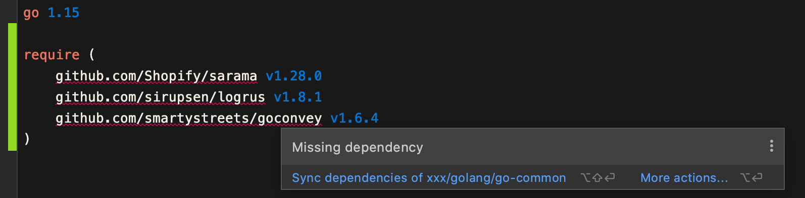
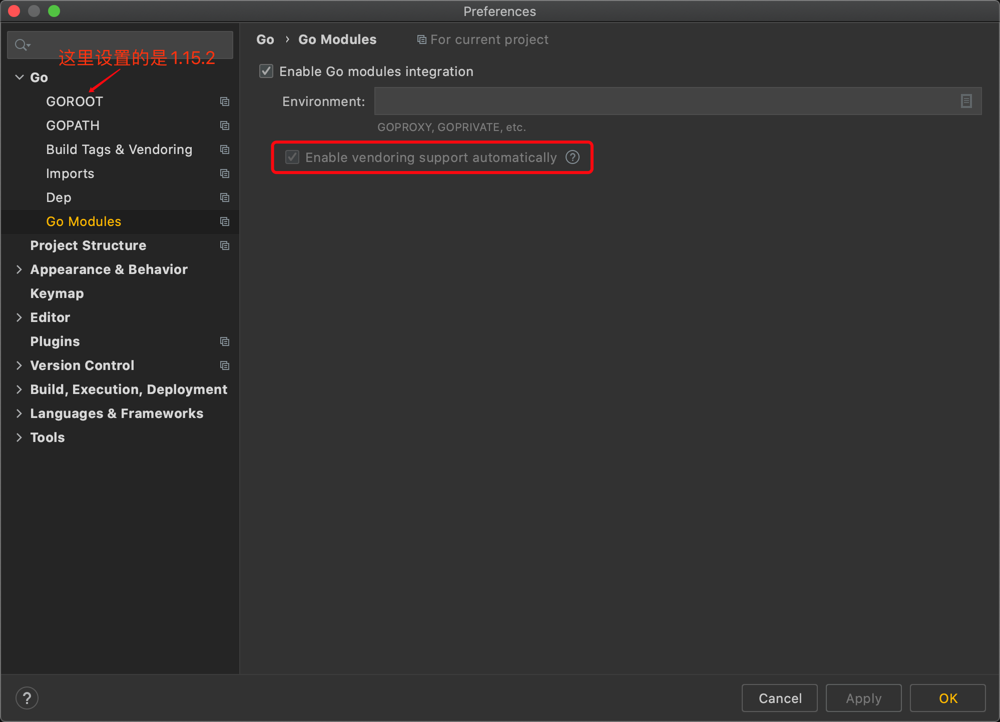

最近在构建部门整个后端团队Go语言的公共组件库，刚开始就遇到了这样一个问题：在go.mod文件中声明了一些依赖，鼠标放上去显示Missing dependency：


虽说问题不大，解决办法也很简单（直接点击IDE的提示Sync dependencies of），但还是想刨根问底一下，弄清楚这个报错的根因。

首先打开一个命令行，输入`go build ./...`，报错：
```Bash
go: inconsistent vendoring in _my_project_path_:
        github.com/Shopify/sarama@v1.28.0: is explicitly required in go.mod, but not marked as explicit in vendor/modules.txt
        github.com/sirupsen/logrus@v1.8.1: is explicitly required in go.mod, but not marked as explicit in vendor/modules.txt
        github.com/smartystreets/goconvey@v1.6.4: is explicitly required in go.mod, but not marked as explicit in vendor/modules.txt

run 'go mod vendor' to sync, or use -mod=mod or -mod=readonly to ignore the vendor directory
```

带着这个错误，查看了go的[官方文档](https://golang.org/ref/mod#build-commands)：
> By default, if the go version in go.mod is 1.14 or higher and a vendor directory is present, the go command acts as if -mod=vendor were used.

因此，在命令行重新执行`go build -mod=mod ./...`后，Terminal不报错了，但发现IDE中上面的错误还是没有消除。


后来才反应过来，IDE的检测机制和命令行输入的命令是区分开的。随后查看了JetBrains的[文档](https://www.jetbrains.com/help/go/configuring-build-constraints-and-vendoring.html#vendoring)：
> In Go 1.14 RC, automatic vendoring mode became a built-in Go feature. Starting from Go 1.14 RC, GoLand also enables automatic vendoring mode by default. You cannot disable this setting.

随后打开Preferences，发现的确如文档中所说，是强制勾选，并且不能取消勾选：


**这也就意味着，如果你要使用go modules并设置go版本是1.14及以上，同时在project根目录下有vendor目录，那么在IDE中go build等命令执行时-mod选项就只能被强制设置为vendor**，因而IDE发现你的vendor目录下没有require中的那些依赖时，就会报Missing dependency的错误。

知道了问题的原因，解决起来也就简单了，一共有两种方案：
1. 按照本文开始所说，直接点击IDE的提示Sync dependencies of，即会执行命令go mod vendor，将你的GOMODCACHE环境变量设置的目录下的依赖包拷贝到project的vendor目录中，IDE能够识别并完成解析编译；
2. 将Preferences中的Go->GOROOT设置为1.14以下的版本，这样在Go->Go Modules中，Enable vendoring support automatically选项就可以取消勾选了，那么IDE默认就会去GOMODCACHE环境变量设置的目录下找依赖了。

到此，该问题就算结束了。虽说看上去是个小问题，但其实要弄懂原因还是要搞清楚Go Modules本身的一些规则以及Go语言版本之间的改动，实际上在解决问题后也加深了对Go语言本身的理解。另外，小小的吐槽一下，GoLand对Go Modules的支持也不必完全按照官方的规则来，可以做到像命令行那样灵活一些来方便开发者。&#x1F606;

---
附环境：使用的是GoLand 2020.3.4